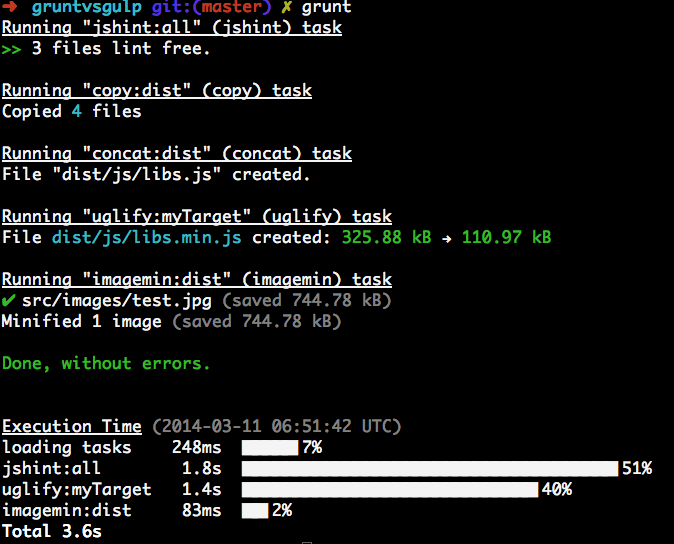

首先安装grunt

```
npm install --save-dev grunt
```

安装我们需要的grunt的插件

* 校验代码 jshint 
* 移动代码 copy
* 合并代码 concat
* 压缩代码 uglify
* 压缩图片 imagemin
* 时间分析的插件 time-grunt

```
npm install --save-dev grunt-contrib-jshint
npm install --save-dev grunt-contrib-uglify
npm install --save-dev grunt-contrib-imagemin
npm install --save-dev grunt-contrib-concat
npm install --save-dev grunt-contrib-copy
```

然后我们来写代码，详细内容还是看`Gruntfile.js`，下面是一张运行完后的截图



可以看出grunt运行时间为2.2s，相应的信息输出很详细

