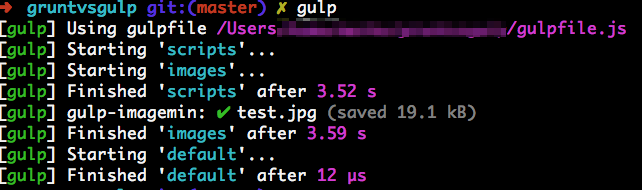

全局安装gulp

```
npm install -g --save-dev gulp
```

安装相关的`gulp`插件

```
npm install --save-dev gulp-concat  gulp-uglify  gulp-imagemin  gulp-jshint
```

按照[开始教程](https://github.com/gulpjs/gulp/blob/master/README.md#gulp---)里的内容创建一个`gulpfile.js`

运行结果，如图：



可以看到`gulp`的要快一些，代码更短，输出更简洁
